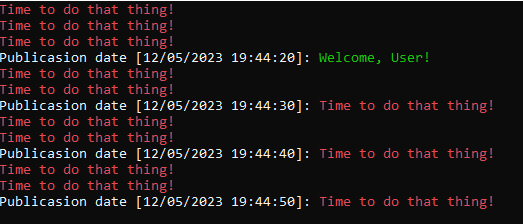

# MultipleTimers

This project seeks to experiment with adding of a simplistic background service components to the console application.

The concept of the application is that there is a notification service, that welcomes the user and says some kind of reminders and a background service that independently annoys them.

## Results

Results that the service's actions demonstrate:

